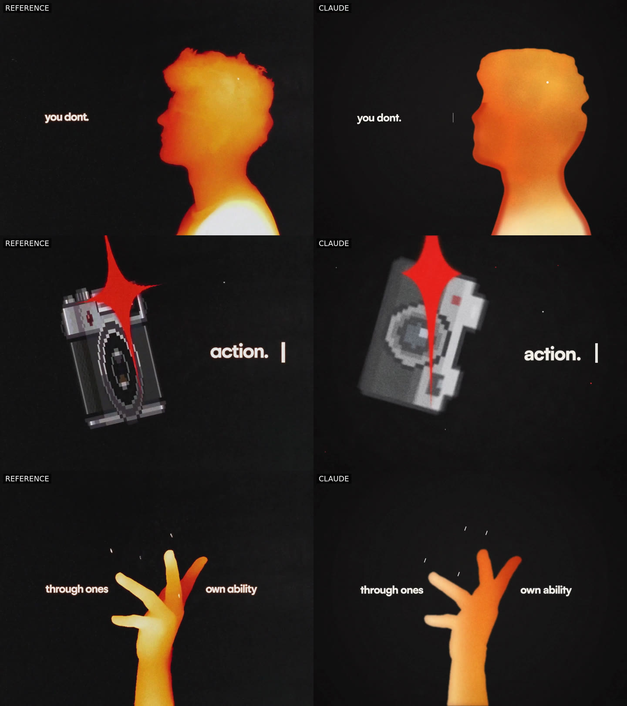

# love-motion-recreation

A frame-by-frame recreation of a 20-second kinetic-typography / pixel-icon motion piece, built in
code with `@napi-rs/canvas` (Skia) and ffmpeg, and refined over 14 iterations with a loop of
Claude Sonnet "judge" agents comparing every version against the original.



## Final result (v14)

| | |
|---|---|
| Final render, 2880×2160 with motion blur | [`media/final/claude_v14_2880x2160.mp4`](media/final/claude_v14_2880x2160.mp4) |
| Original vs Claude, side by side | [`media/final/claude_v14_sidebyside.mp4`](media/final/claude_v14_sidebyside.mp4) |
| The original video and soundtrack | [`media/original/original.mp4`](media/original/original.mp4), [`media/original/original.mp3`](media/original/original.mp3) |
| Every version's render, side-by-side and comparison sheets | [`media/`](media/README.md) |

## How it was made

- **Everything is drawn in code.** 14 shots on a single timeline, each a pure function of time:
  kinetic type, handwriting scribbles, a sparkle star, original pixel-art icons (heart, coin, camera,
  vinyl, cat, …), a 3D icon ring with a bouncing ink ball, word cards, an ink scatter and the
  L‑O‑V‑E finale. Film grain, vignettes and motion blur (temporal supersampling) are applied per frame.
- **The hand is rotoscoped.** For the hand shot (13.8–15.6 s) the silhouette is traced from the
  source video every frame (`scripts/trace-hand.js`) and filled with the thermal shading in code.
  The head profile, icons and everything else are drawn, tuned to measured proportions and colours.
- **Judged and measured.** Each iteration was rendered, turned into reference-vs-render contact
  sheets, and scored by three Sonnet judges (one per section of the video). Their notes drove the
  next version. Shape and colour were also checked numerically: `scripts/shape-compare.js` measures
  silhouette overlap (IoU) and `scripts/region-color.js` compares region colours against the original.

## Progress

Judge scores out of 10 for the three sections (0–7.25 s / 7.5–14.75 s / 15–20.4 s):

| Version | Opening | Middle | Finale | Notable change |
|---|---|---|---|---|
| v1 | 4.5 | 5.0 | 5.0 | First full pass |
| v3 | 6.3 | 6.5 | 6.5 | Timing, scale and layout fixes from the judges |
| v6 | 6.9 | 7.5 | 7.5 | Ring, burst and finale choreography |
| v8 | 6.8 | 7.8 | 7.6 | Rebuilt head, hand and film grain |
| v10 | 7.0 | 7.9 | 8.0 | Measured silhouette fitting (head IoU 0.82) |
| v12 | 7.0 | 8.0 | 8.2 | Head colour matched by measurement |
| v14 | 6.8 | 7.9 | 8.4 | Hand rotoscoped from the source (IoU 0.95–0.96) |
| v15 | 6.5 | 6.0 | 5.0 | Head rotoscoped; every section re-matched to exact frames (stricter judging, see below) |
| v16 | 6.0 | 6.0 | 7.5 | Head shading, traced pen ink and hand tone, red camera flash |
| **v17** | **7.0** | **7.0** | **8.0** | **Redrawn sprites, ring re-fit, measured pen marks** |

From v15 on, the judges compare larger reference/render pairs of the exact same frame, which is much stricter than the earlier contact sheets: re-judged that way, v14 scores 5.0 / 5.5 / 5.5. Earlier sheets were also shifted by 0.1–0.2 s, which is now fixed.

The full table, with every version's files, is in [`media/README.md`](media/README.md).

## Layout

| Path | What |
| --- | --- |
| `src/scenes.js` | The timeline: 14 shots, each a pure function of time |
| `src/lib/sprites.js` | Original pixel-art icons rasterised on an integer grid |
| `src/lib/figures.js` | Thermal-gradient head profile and drawn hand |
| `src/lib/fx.js` | Grain, mottling, vignettes, sparkle stars, scribbles, type |
| `src/render.js` | Multi-threaded renderer (chunked worker pool) → ffmpeg → mux with audio |
| `scripts/compare.sh` | Reference vs render contact sheets (4 fps) |
| `scripts/sidebyside.sh` | Reference vs render side-by-side video |
| `scripts/trace-hand.js` | Rotoscopes hand silhouettes from the source video into `ref/derived/hand/` |
| `scripts/shape-compare.js`, `scripts/region-color.js` | Silhouette IoU and region-colour measurements |
| `site/`, `scripts/publish-site.sh` | Versioned showcase page with the complete media archive |
| `media/` | Web-encoded videos, sheets and overlays for every version, the original, and the final |

## Rebuilding

Put `reference.mp4` and `audio.mp3` in `ref/` (see `ref/README.md`), then:

```bash
npm install && scripts/fetch-fonts.sh
node scripts/trace-hand.js           # hand silhouettes from the source (needed from v14 on)
npm run preview                      # 1440x1080 preview, ~30 s
npm run compare                      # contact sheets in out/compare/latest
npm run render                       # 2880x2160 with 4-sample motion blur
node src/render.js --stills 2.5,8.7  # single frames to out/stills
```

## Showcase at /site

Run `npm run site`, then open http://127.0.0.1:8787/site/. The page includes
the original video and soundtrack, all 14 renders and their side-by-side videos,
the final 2880×2160 render, synchronized version comparison, scores, contact sheets,
and shape overlays. It preserves the original showcase styling and interactions.

`npm run site:build` creates a portable static website in `dist/` using the
committed `media/` archive. Deploy that directory to static hosting; the showcase
lives at `/site/`, and the homepage links to it. No reference downloads or
rendering steps are needed. Generated manifests in `site/` also let the page
work when the repository root is served directly.
