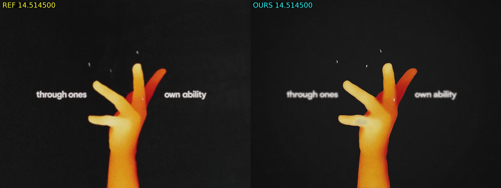

# love-motion-recreation

A frame-by-frame recreation of a 20-second kinetic-typography / pixel-icon motion piece, built in
code with `@napi-rs/canvas` (Skia) and ffmpeg, and refined over 18 iterations with a loop of
Claude Sonnet "judge" agents comparing every version against the original.



## Latest result (v18)

v18 is the latest archived recreation and the version featured on the showcase site.
Its [version record](media/versions/v18/meta.json) identifies source commit `fda013a`.

| | |
|---|---|
| v18 render, 1440×1080 | [`media/versions/v18/render.mp4`](media/versions/v18/render.mp4) |
| Original vs v18, side by side, 2880×1080 | [`media/versions/v18/sidebyside.mp4`](media/versions/v18/sidebyside.mp4) |
| The original video and soundtrack | [`media/original/original.mp4`](media/original/original.mp4), [`media/original/original.mp3`](media/original/original.mp3) |
| Every version's render, side-by-side and comparison sheets | [`media/`](media/README.md) |

### Historical v14 exports

The files in `media/final/` are the earlier v14 exports, not v18 renders.
The archive contains no v18 2880×2160 export; the latest v18 render is linked above.

| | |
|---|---|
| v14 render, 2880×2160 with motion blur | [`media/final/claude_v14_2880x2160.mp4`](media/final/claude_v14_2880x2160.mp4) |
| Original vs v14, side by side, 2880×1080 | [`media/final/claude_v14_sidebyside.mp4`](media/final/claude_v14_sidebyside.mp4) |
| Historical v14 comparison preview | [`media/final/preview.jpg`](media/final/preview.jpg) |

## How it was made

- **Frames are rendered in code.** 14 shots on a single timeline, each a pure function of time:
  kinetic type, handwriting scribbles, a sparkle star, pixel-art icons (heart, coin, camera,
  vinyl, cat, …), a 3D icon ring with a bouncing ink ball, word cards, an ink scatter and the
  L‑O‑V‑E finale. Film grain, vignettes and motion blur (temporal supersampling) are applied per frame.
- **The hand is rotoscoped.** For the hand shot (13.8–15.6 s) the silhouette is traced from the
  source video every frame (`scripts/trace-hand.js`) and filled with the thermal shading in code.
  Later versions also trace head silhouettes and pen/brush ink, derive tone maps, and sample
  icons on the source's pixel grid. Procedural drawing and source-derived shapes are combined.
- **Judged and measured.** Each iteration was rendered, turned into reference-vs-render contact
  sheets, and scored by three Sonnet judges (one per section of the video). Their notes drove the
  next version. Shape and colour were also checked numerically: `scripts/shape-compare.js` measures
  silhouette overlap (IoU) and `scripts/region-color.js` compares region colours against the original.

## Progress

Judge scores out of 10 for the three sections (0–7.25 s / 7.5–14.75 s / 15–20.4 s):

| Version | Opening | Middle | Finale | Notable change |
|---|---|---|---|---|
| v1 | 4.5 | 5.0 | 5.0 | First full pass |
| v3 | 6.3 | 6.5 | 6.5 | Timing, scale and layout fixes from the judges |
| v6 | 6.9 | 7.5 | 7.5 | Ring, burst and finale choreography |
| v8 | 6.8 | 7.8 | 7.6 | Rebuilt head, hand and film grain |
| v10 | 7.0 | 7.9 | 8.0 | Measured silhouette fitting (head IoU 0.82) |
| v12 | 7.0 | 8.0 | 8.2 | Head colour matched by measurement |
| v14 | 6.8 | 7.9 | 8.4 | Hand rotoscoped from the source (IoU 0.95–0.96) |
| v15 | 6.5 | 6.0 | 5.0 | Head rotoscoped; every section re-matched to exact frames (stricter judging, see below) |
| v16 | 6.0 | 6.0 | 7.5 | Head shading, traced pen ink and hand tone, red camera flash |
| v17 | 7.0 | 7.0 | 8.0 | Redrawn sprites, ring re-fit, measured pen marks |
| **v18** | **7.5** | **7.0** | **8.5** | **Source-grid sprites, traced pen and brush ink, graded shirt heat** |

From v15 on, the judges use larger reference/render pairs, a stricter method than the earlier contact sheets: re-judged that way, v14 scores 5.0 / 5.5 / 5.5. The tools also had frame-alignment errors; the current archive includes regenerated v15/v16 sheets and pairs using index alignment. Earlier archived sheets were not all regenerated, and historical scores are not a consistent benchmark.

The full table, with every version's files, is in [`media/README.md`](media/README.md).

## Layout

| Path | What |
| --- | --- |
| `src/scenes.js` | The timeline: 14 shots, each a pure function of time |
| `src/lib/sprites.js` | Original pixel-art icons rasterised on an integer grid |
| `src/lib/figures.js` | Thermal-gradient head profile and drawn hand |
| `src/lib/fx.js` | Grain, mottling, vignettes, sparkle stars, scribbles, type |
| `src/render.js` | Multi-threaded renderer (chunked worker pool) → ffmpeg → mux with audio |
| `scripts/compare.sh` | Reference vs render contact sheets (4 fps) |
| `scripts/sidebyside.sh` | Reference vs render side-by-side video |
| `scripts/trace-hand.js` | Rotoscopes hand silhouettes from the source video into `ref/derived/hand/` |
| `scripts/shape-compare.js`, `scripts/region-color.js` | Silhouette IoU and region-colour measurements |
| `site/`, `scripts/publish-site.sh` | Versioned showcase page with the complete media archive |
| `media/` | Web-encoded videos, sheets and overlays for all 18 versions, the original, and historical v14 exports |

## Rebuilding

Put `reference.mp4` and `audio.mp3` in `ref/` (see `ref/README.md`), then:

```bash
npm install && scripts/fetch-fonts.sh
node scripts/trace-hand.js hand      # source-derived hand silhouettes and tone maps
node scripts/trace-hand.js head      # source-derived head masks (v15 onward)
node scripts/trace-ink.js            # source-derived opening ink (v16 onward)
node scripts/trace-pen.js 413 431 pen soft  # later finale pen / brush masks
node scripts/trace-pen.js 432 487
node scripts/trace-pen.js 413 431 dark
node scripts/trace-pen.js 487 487 dark
node src/render.js --workers 2 --out out/preview.mp4  # bounded-memory preview
npm run compare                      # contact sheets in out/compare/latest
npm run render                       # 2880x2160 with 4-sample motion blur
node src/render.js --stills 2.5,8.7  # single frames to out/stills
```

## Showcase at /site

Run `npm run site`, then open http://127.0.0.1:8787/site/. The page includes
the original video and soundtrack, all 18 archived renders and their side-by-side videos,
v18 as the latest version, the historical v14 2880×2160 export, synchronized version
comparison, scores, contact sheets, and shape overlays. It preserves the original showcase
styling and interactions.

`npm run site:build` creates a portable static website in `dist/` using the
committed `media/` archive. Deploy that directory to static hosting; the showcase
lives at `/site/`, and the homepage links to it. No reference downloads or
rendering steps are needed. Generated manifests in `site/` also let the page
work when the repository root is served directly.

### How I made this

The linked [`site/how-we-made-this.html`](site/how-we-made-this.html) page leads
with the actual initial prompt (local media folder redacted), then 20 selected human
follow-ups in chronological order, preserving their wording and typos. It includes
the visual feedback, requests for measurement and tracing, archive instructions,
and later direction through the start of v17—not a newly written prompt template.
An evidence-backed account of what Claude did follows the conversation, with
the genuine v18 side-by-side video and hand still, plus optional commands to run the
site or regenerate frames. Those assets match the pinned upstream v18 archive;
they do not extend the earlier prompt snapshot. The page distinguishes the archived
v14 final export from later iterations, source-derived tracing from procedural
drawing, and historical scores from verified fidelity. It reflects the corrected
v15/v16 comparisons integrated from main while noting the older sheets' alignment
limitations; the reproduction guide includes an explicit single-frame check.

The article is a checkpoint, not a live session feed. No raw transcript or private
session data is needed or included in the static build. Both pages share theme
preferences; the article also works without JavaScript (copy buttons are optional).

Run `npm run test:site` to build the site and check local links, assets, manifest
media, shared theme behaviour, and HTTP serving under both root and nested paths.
No dependency install is needed for these site tests.
